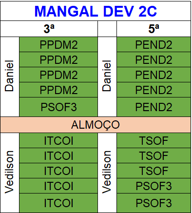

# 👨🏻‍💻 Técnico em Desenvolvimento de Sistemas - TURMA DEV-Clarios

## 🤖 Internet das Coisas

| Objetivo: |
| - |
| Desenvolver capacidades técnicas e socioemocionais necessárias à implementação de soluções com tecnologias de IoT para a integração de sistemas, por meio de sensores, atuadores e aplicações de interfaces gráficas. |

## Horários

- Carga Horária (**Mínimo 75%*- de Frequência)

| Modalidade | Horas | Aulas |
| --- | --- | --- |
| Presencial | 75 horas | 20 aulas |

## Critérios de avaliação (Críticos e Desejaveis)

- Notas (Baseada em requisitos Críticos e desejáveis.**Mínimo 50*- de 0 a 100)

### Composição da Nota

**CC: Critério Crítico*- 
CD: Critério Desejável

| DESEMPENHO | NOTA || DESEMPENHO | NOTA |
| - | :-: | :-: | :-: | :-: |
| 10 CC + 10 CD | 100|| 10 CC | 50 |
| 10 CC + 09 CD | 95 || 09 CC | 45 |
| 10 CC + 08 CD | 90 || 08 CC | 40 |
| 10 CC + 07 CD | 85 || 07 CC | 35 |
| 10 CC + 06 CD | 80 || 06 CC | 30 |
| 10 CC + 05 CD | 75 || 05 CC | 25 |
| 10 CC + 04 CD | 70 || 04 CC | 20 |
| 10 CC + 03 CD | 65 || 03 CC | 15 |
| 10 CC + 02 CD | 60 || 02 CC | 10 |
| 10 CC + 01 CD | 60 || 01 CC | 05 |

## Competências Específicas e Socioemocionais

### Capacidades Técnicas

1. Identificar as diferenças entre as aplicações do IoT e IIoT
2. Identificar os tipos de hardwares e soluções disponíveis
3. Configurar ambientes de desenvolvimento
4. Implementar protocolos de comunicação
5. Integrar a automação em plataforma na nuvem
6. Conectar as aplicações gráficas

### Capacidades Sociais, Organizativas e Metodológicas

1. Demonstrar autogestão
2. Demonstrar pensamento analítico
3. Demonstrar inteligência emocional
4. Demonstrar autonomia

## Conhecimentos:
 
- 1. Automação em IoT
	- 1.1. Residencial
	- 1.2. Pessoal
	- 1.3. Industriais
	- 1.4. Aplicações
- 2. Requisitos para Instalação
	- 2.1. Hardware
		- 2.1.1. Conectividade
		- 2.1.2. Periféricos
	- 2.2. Sensores e Atuadores
		- 2.2.1. Interfaces de I/O
		- 2.2.2. Analógica
- 3. Ambiente de desenvolvimento
	- 3.1. IDE (Integrated Development Enviroment)
		- 3.1.1. Tipos
		- 3.1.2. Seleção
	- 3.2. Configuração
- 4. Protocolos de comunicação
	- 4.1. Message Queuing Telemetry Transport (MQTT)
	- 4.2. Hypertext Transfer Protocol (HTTP)
	- 4.3. Bluetooth e Bluetooth Low Energy (BLE)
	- 4.4. Zigbee
	- 4.5. LoRaWAN
	- 4.6. NB-IoT (Narrowband IoT) e LTE-M
- 5. Preparação de dispositivo IoT
	- 5.1. Conexão com a nuvem
	- 5.2. Envio de dados
	- 5.3. Configuração
		- 5.3.1. Regras
		- 5.3.2. Lógica
	- 5.4. Resultados
		- 5.4.1. Visualização
		- 5.4.2. Controle
- 6. Interfaces com elementos visuais interativos
	- 6.1. Linguagens
		- 6.1.1. HTML
		- 6.1.2. CSS
		- 6.1.3. JavaScript
	- 6.2. Aplicações
		- 6.2.1. Visualização de Dados
		- 6.2.2. Interatividade
		- 6.2.3. Testes
		- 6.2.4. Feedbacks

## Referências básicas
- Bahga, A., & Madisetti, V. (2014). Internet of Things: A Hands-On Approach. VPT.
- Lea, P., & Moffat, V. (2018). Internet of Things for Architects: Architecting IoT solutions by implementing sensors, communication infrastructure, edge computing, analytics, and security. Packt Publishing.
- Hanes, D., Salgueiro, G., & Grossetete, P. (2017). IoT Fundamentals: Networking Technologies, Protocols, and Use Cases for the Internet of Things. Cisco Press.

## Referências complementares
- Javed, A. (2016). Building Arduino Projects for the Internet of Things: Experiments with RealWorld Applications. Apress.
- Rowland, C., Goodman, E., Charlier, M., Light, A., & Lui, A. (2015). Designing Connected Products: UX for the Consumer Internet of Things. O'Reilly Media.
- Moeller, J. (2018). Practical Internet of Things for Beginners: Design, Deploy, and Secure Your IoT Projects. CreateSpace Independent Publishing Platform.
- Kranz, M. (2016). Building the Internet of Things: Implement New Business Models, Disrupt Competitors, Transform Your Industry. Wiley.
- Schwartz, M. (2016). Internet of Things with ESP8266: Build Exciting Internet of Things Projects Using the ESP8266 Wi-Fi Chip. CreateSpace Independent Publishing Platform