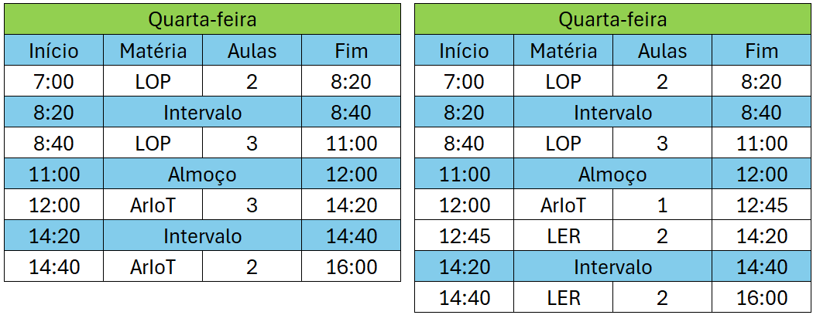

# 👨🏻‍💻 Técnico em Desenvolvimento de Sistemas - TURMA D 2025
## 🤖 ARQUITETURA DE REDES COM IOT
|Objetivo:|
|-|
|Desenvolver capacidades básicas e socioemocionais necessárias para utilizar serviços de redes locais e industriais, para aplicações em nuvens públicas e privadas|

## Horários

- Carga Horária (**Mínimo 75%** de Frequência)

|Modalidade|Horas|Aulas|
|-|-|-|
|Presencial|75 horas|100 aulas|

## Critérios de avaliação (Críticos e Desejaveis)

- Notas (Baseada em requisitos Críticos e desejáveis. **Mínimo 50** de 0 a 100)

### Composição da Nota

|DESEMPENHO|NOTA| |DESEMPENHO|NOTA|
|-|:-:|:-:|:-:|:-:|
|09 CC + 09 CD|100| |09 CC|50|
|08 CC + 08 CD|95| |08 CC|45|
|07 CC + 07 CD|90| |07 CC|40|
|06 CC + 06 CD|85| |06 CC|35|
|05 CC + 05 CD|80| |05 CC|30|
|04 CC + 04 CD|75| |04 CC|25|
|03 CC + 03 CD|70| |03 CC|20|
|02 CC + 02 CD|65| |02 CC|15|
|01 CC + 01 CD|60| |01 CC|10|

**CC: Critério Crítico**  
CD: Critério Desejável

## Competências Específicas e Socioemocionais 

### Capacidades Básicas:
- 1 Identificar as topologias empregadas nas redes de computadores
- 2 Identificar modelos e protocolo TCP/IP de rede e suas aplicações na comunicação entre sistemas computacionais
- 3 Utilizar ativos e passivos que compõem uma rede de computadores
- 4 Aplicar arquitetura de hardware em IoT
- 5 Configurar os tipos de serviços fundamentais de redes

### Capacidades Socioemocionais
- 1 Demonstrar autogestão
- 2 Demonstrar pensamento analítico
- 3 Demonstrar inteligência emocional
- 4 Demonstrar autonomia

## Conhecimentos:
- 1 Arquitetura de Redes
	- 1.1. Definição
	- 1.2. Tipos
		- 1.2.1.Rede Cliente-Servidor
		- 1.2.2.Rede Peer-to-Peer (P2P)
		- 1.2.3.Rede em Camadas
		- 1.2.4.Rede em Árvore (Hierárquica)
		- 1.2.5.Rede em Anel (Ring)
		- 1.2.6.Rede em Malha (Mesh)
	- 1.3. Meios de transmissão de dados
		- 1.3.1.Cabeado
		- 1.3.2.Sem fio
- 2 Modelos e protocolo de redes
	- 2.1. Definição
	- 2.2. Protocolo TCP/IP
		- 2.2.1.Definição
		- 2.2.2.Endereçamento de IPv4
		- 2.2.3.Endereçamento de IPv6
		- 2.2.4.Portas
	- 2.3. Protocolo MQTT (Message Queuing Telemetry Transport)
		- 2.3.1.Definição
		- 2.3.2.Aplicação
- 3 Equipamentos de rede
	- 3.1. Roteador
	- 3.2. Switch
	- 3.3. Access Point
	- 3.4. Gateway
	- 3.5. Firewall
- 4 Arquitetura de hardware IoT
	- 4.1. Unidades de medidas computacionais
	- 4.2. I/O (Inputs e Outputs)
	- 4.3. Processadores
	- 4.4. Sensores
	- 4.5. Memórias
	- 4.6. Armazenamento
- 5 Serviços de Redes
	- 5.1. Definição
	- 5.2. Tipos
		- 5.2.1.FTP (File Transfer Protocol)
		- 5.2.2.HTTP/HTTPS (Hypertext Transfer Protocol/Seguro)
		- 5.2.3.RDP (Remote Desktop Protocol)

## Referências básicas
- SERVIÇO NACIONAL DE APRENDIZAGEM INDUSTRIAL. Arquitetura de Redes de Computadores - Serie Tecnologia da Informação - Hardware, 1ª, Editora SENAI, 2017.
- SERVIÇO NACIONAL DE APRENDIZAGEM INDUSTRIAL. Servidores de Redes - Serie Tecnologia da Informação - Hardware, 1ª, Editora SENAI, 2019.
- SERVIÇO NACIONAL DE APRENDIZAGEM INDUSTRIAL. Serviços de Rede Local - Serie Tecnologia da Informação - Hardware, 1ª, Editora SENAI, 2019.
- SERVIÇO NACIONAL DE APRENDIZAGEM INDUSTRIAL. Infraestrutura de Rede LAN E WLAN - Serie Tecnologia da Informação - Hardware, 1ª, Editora SENAI, 2019.
- KUROSE, James; ROSS, Keith. Redes de computadores e a Internet, 8ª, Bookman Editora, 2020.

## Referências complementares
- SILVA, Cassian Fagundes. Arquitetura e práticas TCP/IP I e II. 1ª, Contentus, 2021.
- FERNANDES, Alexandre. Redes de Computadores: Fundamentos, 8ª, Bookman Editora, 2020.
- BASSO, Dougla Eduardo. Administração de Redes de Computadores. 1ª, Contentus, 2020.
- COMER, Douglas E. Redes de Computadores e Internet. 1ª, Bookman Editora, 2016.
- ENGST, Adam; FLEISHMAN, Glenn. Kit do iniciante em redes sem fio: o guia prático sobre redes Wi-Fi para Windowns e Macintosh. 2ª, Editora Pearson, 2005.
