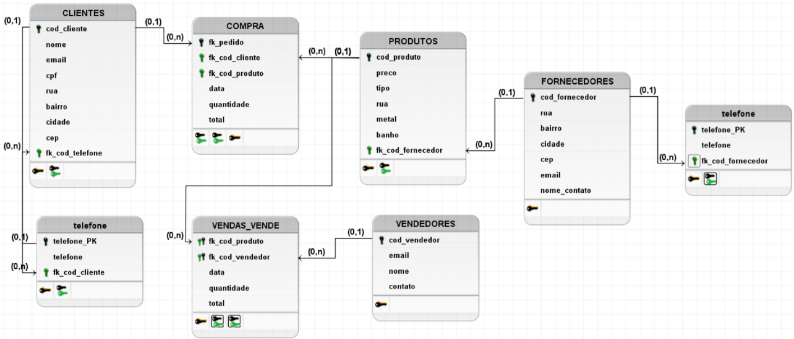
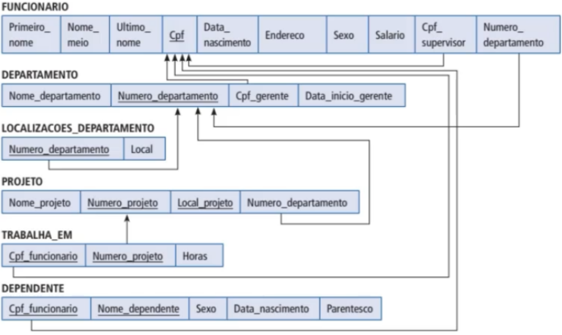

# 👨🏻‍💻 Técnico em Desenvolvimento de Sistemas - TURMA MANGAL DEV-D 2025
## 🤖 BANCO DE DADOS - Aula 04 - Modelagem Lógica
|Objetivo:|
|-|
|Desenvolver capacidades técnicas e socioemocionais relativas à criação da estrutura para armazenamento, manipulação e persistência de dados.|

### O que é a  Modelagem Lógica?
**Definição:**

	É uma fase no processo de design de banco de dados que segue a modelagem conceitual. 

	É criado a partir das descrições dos dados representadas em um modelo conceitual. 

	Ela descreve como os dados serão armazenados no banco de dados, identificando as entidades, os atributos, as chaves primárias e estrangeiras e os seus relacionamentos.
 

**Tipos de Modelagem Lógica:**
- **Modelagem Vertical**: 

	

- **Modelagem Horizontal**:

	

## Conhecimentos Trabalhados:
- 1. Sistema Gerenciador de Banco de Dados (SGBD)
	- 1.4. Estrutura
		- 1.4.1.Tabela
		- 1.4.2.Registro
		- 1.4.3.Campo
		- 1.4.4.Tipos de dados
- 2. Modelo relacional
	- 2.1. Modelagem
		- 2.1.2.Modelo Entidade Relacionamento - MER
		- 2.1.3.Diagrama Entidade Relacionamento - DER
## Capacidade técnica trabalhada:
- 4. Elaborar diagramas de modelagem do banco de dados de acordo com a arquitetura definida
- 5. Utilizar relacionamentos entre as tabelas do banco de dados

### Critérios Críticos trabalhados:
 - Produziu diagramas de modelagem em conformidade com a arquitetura definida apresentando representação das entidades, relacionamentos, atributos e chaves.
 - Estabeleceu relacionamentos entre as tabelas definindo chaves primárias e estrangeiras com integridade referencial entre as tabelas. 

### Critérios Desejáveis trabalhados:
- Fez uso de notações apropriadas e convenções visuais eficientes para produzir diagramas de modelagem em conformidade com a arquitetura definida apresentando representação das entidades, relacionamentos, atributos e chaves.
- Fez uso boas práticas para estabelecer relacionamentos entre as tabelas ao definir chaves primárias e estrangeiras observando a consistência dos dados.

## Para Saber Mais
Video Aula

## [Slides Aula 04](../aula01/aula04.pdf)