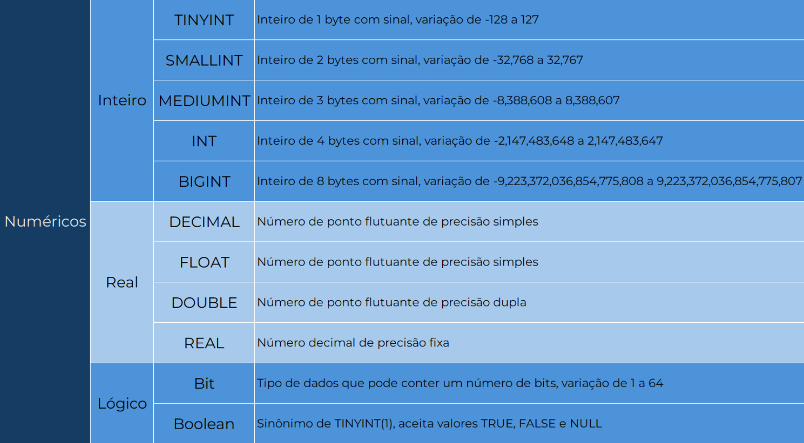
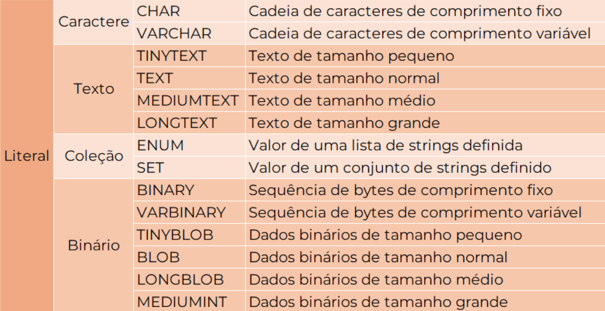
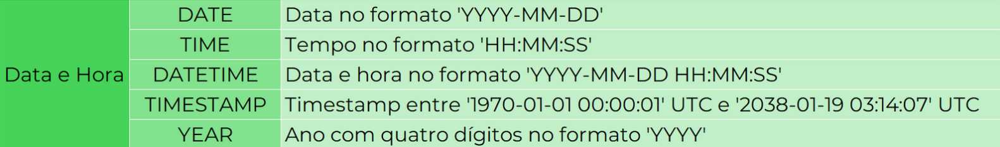
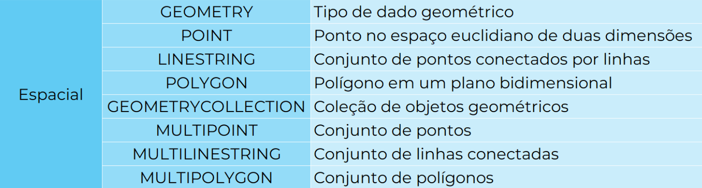
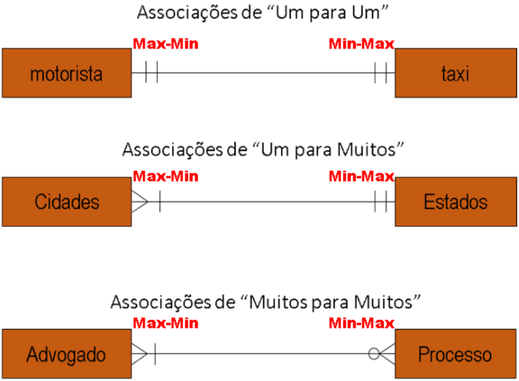

# 👨🏻‍💻 Técnico em Desenvolvimento de Sistemas - TURMA DEV-Clarios
## 🤖 BANCO DE DADOS - Aula 04 - Modelagem Lógica
|Objetivo:|
|-|
|Desenvolver capacidades técnicas e socioemocionais relativas à criação da estrutura para armazenamento, manipulação e persistência de dados.|

### O que é a  Modelagem Lógica?
**Definição:** O modelo físico é a representação mais detalhada e específica do banco de dados, levando em conta os detalhes de implementação, como tipos de dados, chaves primárias e estrangeiras, espaços de armazenamento, entre outros.
 
## Tipos primitivos

**Int:** Inteiro. O tipo INT é usado para armazenar valores numéricos inteiros. 

**Varchar:** Abreviação de "variable character", é um tipo de dados usado para armazenar strings de comprimento variável. Isso significa que você pode armazenar cadeias de caracteres de comprimento variável até um limite especificado. Por exemplo, VARCHAR(255) permite armazenar uma string de até 255 caracteres.

**Decimal:** O tipo DECIMAL é usado para valores numéricos com precisão fixa. Ele é usado para armazenar números decimais exatos, onde o número total de dígitos (precisão) e o número de dígitos após o ponto decimal (escala) podem ser especificados. Por exemplo, DECIMAL(10,2) pode armazenar um número com até 10 dígitos no total, dos quais 2 estão após o ponto decimal.

**Datetime:** O tipo DATETIME é usado para armazenar valores de data e hora em um formato específico (YYYY-MM-DD HH:MM:SS). Ele pode armazenar datas e horas no intervalo de '1000-01-01 00:00:00' a '9999-12-31 23:59:59'. Este tipo é útil para armazenar informações de data e hora com precisão.

**Date:** Armazena datas no formato "YYYY-MM-DD", sem considerar informações sobre horas específicas.

**Tipos Primitivos:**
- **Tipos Numéricos**: 

	

- **Tipos Literais**:

	

- **Tipos Data e Hora**:

	

- **Tipos Especiais**:

	

## Notações Gráficas

### **Notação Min-Max**

Representa a quantidade mínima e máxima de ocorrências de uma entidade em um relacionamento.

É representada por um par de números, onde o primeiro indica o mínimo e o segundo o máximo. Por exemplo:

### **Notação James Martin (Pé de Galinha)**
	
Uma representação visual simplificada da notação minima-máxima, utilizando símbolos gráficos que se assemelham a pés de galinha.

**Relacionamento conceitual de “um”:**

**Relacionamento conceitual de “muitos”:**

**Relacionamento conceitual de “somente um":**

**Relacionamento conceitual de “Minimo zero e Máximo um":**

**Relacionamento conceitual de “Minimo um e Máximo muitos":**

**Relacionamento conceitual de “Minimo zero e Máximo muitos":**

**Relacionamentos com Notação James Martin:**

### Constraints  (restrições)
	Constraints (restrições) são utilizadas para definir as características e comportamentos de colunas em uma tabela. Cada uma delas impõe uma regra específica sobre os dados que podem ser armazenados em uma coluna, garantindo a integridade e consistência dos dados.

**PK - Primary Key:**

	É a chave primária de uma tabela. Uma chave primária identifica de forma única cada registro (linha) em uma tabela.
	
	Características:
	- Deve ser única para cada registro.
	- Não pode conter valores nulos (NULL).
	- Geralmente é um índice para melhorar o desempenho de consultas.

**NN - Not Null:**

	Indica que a coluna não pode conter valores nulos. Um valor nulo representa a ausência de um valor.
	
	Objetivo: Garantir que a coluna sempre tenha um valor válido.

**UQ - Unique:**
	
	Indica que todos os valores da coluna devem ser únicos. Ou seja, não pode haver dois registros com o mesmo valor nessa coluna.
	
	Objetivo: Garantir a unicidade de um determinado atributo dentro da tabela.

**B - Binary:**
	
	Indica que a coluna armazena dados binários, como imagens, arquivos ou dados compactados.
	
	Objetivo: Permite armazenar dados em formato bruto, sem interpretações específicas.

**UN - Unsigned:**
	
	Indica que a coluna armazena apenas valores não negativos (zero ou positivos).
	
	Objetivo: Utilizado principalmente para colunas numéricas que representam quantidades ou contagens.

**AI - Auto Increment:**
	
	Gera automaticamente um valor numérico único e crescente para cada novo registro inserido na tabela.
	
	Objetivo: É comumente utilizado para criar chaves primárias numéricas sequenciais.

**G - Generated:**
	
	Permite definir uma expressão para calcular o valor de uma coluna com base em outras colunas ou valores constantes.
	
	Objetivo: É útil para criar colunas calculadas ou valores derivados.

## Conhecimentos Trabalhados:
- 1. Sistema Gerenciador de Banco de Dados (SGBD)
	- 1.4. Estrutura
		- 1.4.1.Tabela
		- 1.4.2.Registro
		- 1.4.3.Campo
		- 1.4.4.Tipos de dados
- 2. Modelo relacional
	- 2.1. Modelagem
		- 2.1.2.Modelo Entidade Relacionamento - MER
		- 2.1.3.Diagrama Entidade Relacionamento - DER
## Capacidade técnica trabalhada:
- 4. Elaborar diagramas de modelagem do banco de dados de acordo com a arquitetura definida
- 5. Utilizar relacionamentos entre as tabelas do banco de dados

### Critérios Críticos trabalhados:
 - Produziu diagramas de modelagem em conformidade com a arquitetura definida apresentando representação das entidades, relacionamentos, atributos e chaves.
 - Estabeleceu relacionamentos entre as tabelas definindo chaves primárias e estrangeiras com integridade referencial entre as tabelas. 

### Critérios Desejáveis trabalhados:
- Fez uso de notações apropriadas e convenções visuais eficientes para produzir diagramas de modelagem em conformidade com a arquitetura definida apresentando representação das entidades, relacionamentos, atributos e chaves.
- Fez uso boas práticas para estabelecer relacionamentos entre as tabelas ao definir chaves primárias e estrangeiras observando a consistência dos dados.

## Para Saber Mais
Video Aula

## [Slides Aula 05](../aula01/aula05.pdf)