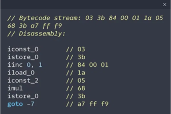
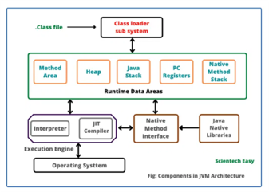
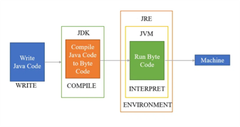
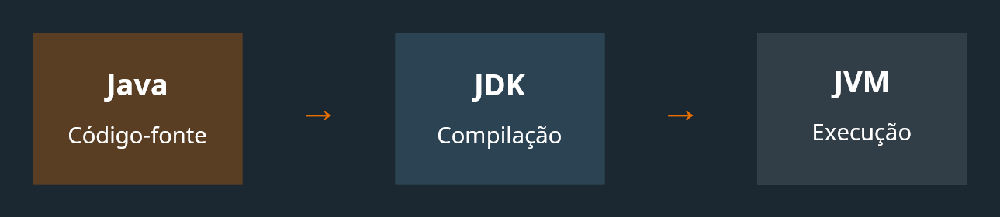

# 👨🏻‍💻 Técnico em Desenvolvimento de Sistemas - TURMA Mangal 2025-DEV-D

## 🍵 Programação Backend - Aula 01 - Revisão e Histórico do Java
|Objetivo da aula:|
|-|
|Desenvolver capacidades técnicas e socioemocionais relativas à criação da estrutura para armazenamento, manipulação e persistência de dados.|


## ☕ A História do Java

<details>
 <summary>Ver mais</summary>

Java é uma das linguagens de programação mais influentes e populares do mundo. Vamos explorar sua evolução:

<details>
 <summary><strong>📌 Origem do Java</strong></summary>

### 🛠️ Projeto Green (1991)

O Java foi criado por uma equipe da Sun Microsystems liderada por **James Gosling**. Originalmente, a linguagem se chamava **Oak**.

A ideia era criar uma linguagem para eletrodomésticos inteligentes — sim, geladeiras e TVs!

### 🌍 Java 1.0 (1995)

O nome “Java” foi adotado em 1995, inspirado no café da ilha de Java (Indonésia).

A grande virada foi quando a Netscape anunciou suporte ao Java em seus navegadores, dando origem aos **applets**.

</details>

---

<details>
<summary><strong>💡 Java na Atualidade</strong></summary>

- Utilizado em bancos, fintechs, sistemas de missão crítica.
- Presente no Android (embora o Android use uma versão própria da VM).
- Concorrência com Kotlin, mas ainda amplamente usado.

**Versão LTS atual:** Java 21 (lançada em setembro de 2023)

</details>

---

<details>
<summary><strong>🎯 Curiosidades</strong></summary>

- Java foi pensado para ser portátil: “**Write Once, Run Anywhere**”.
- O mascote do Java se chama **Duke**.
- O nome “Java” venceu sugestões como “Silk” e “DNA”.

</details>

---

🧠 _“Java is to JavaScript what car is to carpet.” — Chris Heilmann_
</details>

## 🧩 A Estrutura do Java
<details>
 <summary>Ver mais</summary>

<details>
 <summary><strong>📌 Java: A Linguagem de Programação</strong></summary>

- Linguagem orientada a objetos
- Código-fonte (.java) compilado para bytecode (.class)
- Independente de plataforma
- Gerenciamento automático de memória
````java
public class Hello {
  public static void main(String[] args) {
    System.out.println("Hello, Java!");
  }
}
````


</details>

---

<details>
 <summary><strong>📌 JVM: A Máquina Virtual Java</strong></summary>

- Executa o bytecode Java
- Gerencia memória e garbage collection
- Componentes: Class Loader, Execution Engine, Memory Area
- Implementações específicas para cada plataforma

	WORA - Write Once, Run Anywhere
	
A JVM é o que permite que o mesmo bytecode Java seja executado em diferentes sistemas operacionais sem modificações.



</details>

---

<details>
 <summary><strong>📌 JDK: O Kit de Desenvolvimento Java</strong></summary>
 
- Pacote completo para desenvolvimento Java
- Contém o JRE (Java Runtime Environment)
- Inclui ferramentas de desenvolvimento
- Bibliotecas e APIs para desenvolvimento

**Principais Ferramentas**
- javac (compilador)
- java (executor)
- jar (empacotador)
- javadoc (documentação)




</details>

---

<details>
 <summary><strong>📌 Java, JVM e JDK: Trabalhando Juntos</strong></summary>

- Desenvolvedor escreve código Java
- JDK fornece ferramentas para compilação
- JVM executa o bytecode em qualquer plataforma
- Ciclo completo: desenvolvimento → execução



	Ecossistema Completo
	
	O poder do Java está na integração destes três componentes, permitindo desenvolvimento eficiente e execução multiplataforma.

</details>

</details>

## 👨🏻‍💻 Introdução a linguagem Java

<details>
	<summary>Ver mais</summary>

## 📌 Introdução

<details>
<summary>Ver mais</summary>

Java é uma linguagem de programação robusta, orientada a objetos e independente de plataforma. Neste resumo, focaremos nos conceitos fundamentais da linguagem, especificamente na manipulação de dados através de variáveis, estruturas de dados como vetores e matrizes, e conversão entre tipos de dados, além de estruturas de controle de fluxo.

**📌 Características Fundamentais do Java**

- Linguagem compilada para bytecode
- Independente de plataforma (Write Once, Run Anywhere)
- Tipagem estática e forte
- Gerenciamento automático de memória
- Sintaxe similar ao C/C++

**💡 Por que aprender esses fundamentos?**

- Base para qualquer programa Java
- Essencial para manipulação de dados
- Preparação para estruturas mais complexas
- Fundamento para algoritmos e lógica de programação

</details>


## 1. Estrutura Básica de um Programa Java

<details>
<summary>Ver mais</summary>

Todo programa Java começa com uma estrutura fundamental que define sua classe principal e o ponto de entrada para a execução.

**📌 `public class NomeDaClasse`**

- Em Java, todo código reside dentro de classes. Uma classe é um modelo para criar objetos (embora não abordaremos objetos neste resumo).
- `public`: Modificador de acesso que indica que a classe é acessível de qualquer lugar.
- `class`: Palavra-chave para declarar uma classe.
- `NomeDaClasse`: O nome da sua classe. Por convenção, nomes de classes em Java usam `CamelCase` (a primeira letra de cada palavra é maiúscula).

**📌 Método `main(String[] args)`**

- É o ponto de entrada de qualquer aplicação Java. Quando você executa um programa Java, a JVM (Java Virtual Machine) procura e executa este método.
- `public`: O método é acessível publicamente.
- `static`: Permite que o método seja chamado sem a necessidade de criar uma instância da classe.
- `void`: Indica que o método não retorna nenhum valor.
- `main`: O nome padrão do método principal.
- `(String[] args)`: Parâmetro que permite que o programa receba argumentos de linha de comando como um array de Strings.

**📌 Impressão com `System.out.println()`**

- Usado para exibir texto ou valores no console (saída padrão).
- `System`: Uma classe padrão do Java que fornece acesso a recursos do sistema.
- `out`: Um objeto `PrintStream` dentro da classe `System` que representa a saída padrão.
- `println()`: Um método que imprime o argumento fornecido e adiciona uma nova linha no final.

**📌 Convenção de Nomes**

Seguir as convenções de nomes é crucial para a legibilidade e manutenção do código Java:

- **Classes:** `CamelCase` (ex: `MinhaPrimeiraClasse`, `CalculadoraDeNotas`)
- **Métodos e Variáveis:** `camelCase` (ex: `calcularMedia`, `nomeCompleto`, `idade`)
- **Constantes:** `UPPER_CASE_SNAKE_CASE` (ex: `MAX_VALUE`, `PI`)
- **Pacotes:** `lowercase.separated.by.dots` (ex: `com.meuprojeto.util`)

**📌 Exemplo de Estrutura Básica**

```java
// Nome do arquivo: MeuPrimeiroPrograma.java

public class MeuPrimeiroPrograma {
    public static void main(String[] args) {
        // Imprime uma mensagem no console
        System.out.println("Olá, Mundo!");
        System.out.println("Este é o meu primeiro programa Java.");

        // Exemplo de variável (abordado em detalhes na próxima seção)
        int anoAtual = 2025;
        System.out.println("Estamos no ano de " + anoAtual);
    }
}
```

</details>


## 2. Variáveis e Tipos Primitivos

<details>
<summary>Ver mais</summary>

Em Java, variáveis são espaços na memória usados para armazenar dados. Toda variável deve ter um tipo de dado definido, que determina o tipo de valor que ela pode armazenar e as operações que podem ser realizadas com ela.

**📌 Declaração e Atribuição de Variáveis**

A sintaxe básica para declarar uma variável é: `tipo nomeDaVariavel;`
Para atribuir um valor a uma variável, usamos o operador de atribuição `=`. Você pode atribuir um valor na declaração ou posteriormente.

```java
// Declaração de variável
int idade;

// Atribuição de valor
idade = 30;

// Declaração e atribuição na mesma linha
String nome = "Maria";
double altura = 1.75;
boolean estaAtivo = true;
```

**📌 Tipos Primitivos**

Java possui 8 tipos de dados primitivos, que são os blocos de construção fundamentais para armazenar informações. Eles são divididos em categorias:

**1. Tipos Numéricos Inteiros:**

- `byte`: Armazena números inteiros de -128 a 127 (8 bits).
- `short`: Armazena números inteiros de -32.768 a 32.767 (16 bits).
- `int`: Armazena números inteiros de -2.147.483.648 a 2.147.483.647 (32 bits). É o tipo mais comum para inteiros.
- `long`: Armazena números inteiros muito grandes (64 bits). Deve ser sufixado com `L` ou `l` (ex: `10000000000L`).

**2. Tipos Numéricos de Ponto Flutuante (Decimais):**

- `float`: Armazena números decimais de precisão simples (32 bits). Deve ser sufixado com `F` ou `f` (ex: `3.14F`).
- `double`: Armazena números decimais de precisão dupla (64 bits). É o tipo padrão para decimais e não precisa de sufixo.

**3. Tipo Caractere:**

- `char`: Armazena um único caractere Unicode (16 bits). Deve ser colocado entre aspas simples (ex: `'A'`, `'@'`, `'5'`).

**4. Tipo Lógico:**

- `boolean`: Armazena valores lógicos `true` (verdadeiro) ou `false` (falso).

**📌 Exemplos de Uso de Tipos Primitivos**

```java
public class ExemploTiposPrimitivos {
    public static void main(String[] args) {
        // Inteiros
        byte idade = 25;
        short ano = 2024;
        int populacao = 1500000;
        long numeroGrande = 9876543210L;

        // Decimais
        float temperatura = 23.5f;
        double pi = 3.1415926535;

        // Caractere
        char inicialNome = 'J';

        // Lógico
        boolean diaEnsolarado = true;

        System.out.println("Idade: " + idade);
        System.out.println("Ano: " + ano);
        System.out.println("População: " + populacao);
        System.out.println("Número Grande: " + numeroGrande);
        System.out.println("Temperatura: " + temperatura);
        System.out.println("PI: " + pi);
        System.out.println("Inicial do Nome: " + inicialNome);
        System.out.println("Dia Ensolarado: " + diaEnsolarado);
    }
}
```

</details>


## 3. Operadores

<details>
<summary>Ver mais</summary>

Operadores são símbolos especiais que realizam operações em um ou mais operandos (valores ou variáveis). Em Java, os operadores são classificados em diferentes categorias.

**📌 Operadores Aritméticos**

Usados para realizar operações matemáticas básicas.

| Operador | Descrição        | Exemplo           | Resultado |
| :------- | :--------------- | :---------------- | :-------- |
| `+`      | Adição           | `5 + 3`           | `8`       |
| `-`      | Subtração        | `10 - 4`          | `6`       |
| `*`      | Multiplicação    | `6 * 2`           | `12`      |
| `/`      | Divisão          | `10 / 3` (int)    | `3`       |
| `%`      | Módulo (Resto)   | `10 % 3`          | `1`       |

```java
public class ExemploOperadoresAritmeticos {
    public static void main(String[] args) {
        int a = 10;
        int b = 3;

        System.out.println("a + b = " + (a + b)); // 13
        System.out.println("a - b = " + (a - b)); // 7
        System.out.println("a * b = " + (a * b)); // 30
        System.out.println("a / b = " + (a / b)); // 3 (divisão inteira)
        System.out.println("a % b = " + (a % b)); // 1

        double c = 10.0;
        double d = 3.0;
        System.out.println("c / d = " + (c / d)); // 3.333...
    }
}
```

**📌 Operadores de Comparação (Relacionais)**

Usados para comparar dois valores e retornar um resultado booleano (`true` ou `false`).

| Operador | Descrição                  | Exemplo         | Resultado |
| :------- | :------------------------- | :-------------- | :-------- |
| `==`     | Igual a                    | `5 == 5`        | `true`    |
| `!=`     | Diferente de               | `5 != 3`        | `true`    |
| `>`      | Maior que                  | `5 > 3`         | `true`    |
| `<`      | Menor que                  | `5 < 3`         | `false`   |
| `>=`     | Maior ou igual a           | `5 >= 5`        | `true`    |
| `<=`     | Menor ou igual a           | `5 <= 3`        | `false`   |

```java
public class ExemploOperadoresComparacao {
    public static void main(String[] args) {
        int x = 10;
        int y = 20;

        System.out.println("x == y: " + (x == y)); // false
        System.out.println("x != y: " + (x != y)); // true
        System.out.println("x > y: " + (x > y));   // false
        System.out.println("x < y: " + (x < y));   // true
        System.out.println("x >= y: " + (x >= y)); // false
        System.out.println("x <= y: " + (x <= y)); // true
    }
}
```

**📌 Operadores Lógicos**

Usados para combinar expressões booleanas e retornar um resultado booleano.

| Operador | Descrição | Exemplo                     | Resultado |
| :------- | :-------- | :-------------------------- | :-------- |
| `&&`     | E (AND)   | `true && false`             | `false`   |
| `||`     | OU (OR)   | `true || false`             | `true`    |
| `!`      | NÃO (NOT) | `!true`                     | `false`   |

```java
public class ExemploOperadoresLogicos {
    public static void main(String[] args) {
        boolean condicao1 = true;
        boolean condicao2 = false;

        System.out.println("condicao1 && condicao2: " + (condicao1 && condicao2)); // false
        System.out.println("condicao1 || condicao2: " + (condicao1 || condicao2)); // true
        System.out.println("!condicao1: " + (!condicao1));                     // false

        int idade = 18;
        double salario = 1500.00;

        // Exemplo: Maior de idade E tem salário acima de 1000
        boolean elegivel = (idade >= 18) && (salario > 1000);
        System.out.println("Elegível: " + elegivel); // true
    }
}
```

</details>


## 4. Casting (Conversão de Tipos)

<details>
<summary>Ver mais</summary>

Casting é o processo de converter um tipo de dado em outro. Em Java, isso pode ocorrer de forma implícita (automática) ou explícita (manual), dependendo da compatibilidade dos tipos.

**📌 Casting Implícito (Widening Conversion)**

Ocorre automaticamente quando você converte um tipo de dado de menor capacidade para um de maior capacidade. Não há perda de dados, pois o tipo de destino pode armazenar todos os valores do tipo de origem.

**Ordem de Conversão (do menor para o maior):**
`byte` → `short` → `int` → `long` → `float` → `double`

```java
public class ExemploCastingImplicito {
    public static void main(String[] args) {
        int meuInt = 100;
        double meuDouble = meuInt; // int para double (automático)
        System.out.println("int: " + meuInt);      // Saída: 100
        System.out.println("double: " + meuDouble); // Saída: 100.0

        char meuChar = 'A';
        int valorAscii = meuChar; // char para int (automático, converte para valor ASCII)
        System.out.println("char: " + meuChar);    // Saída: A
        System.out.println("int (ASCII): " + valorAscii); // Saída: 65
    }
}
```

**📌 Casting Explícito (Narrowing Conversion)**

Ocorre quando você converte um tipo de dado de maior capacidade para um de menor capacidade. Este tipo de casting **não é automático** e requer que você especifique a conversão explicitamente usando parênteses `(tipo_destino)`. Pode haver **perda de dados** ou **arredondamento** se o valor original for muito grande para o tipo de destino.

```java
public class ExemploCastingExplicito {
    public static void main(String[] args) {
        double meuDouble = 9.78;
        int meuInt = (int) meuDouble; // double para int (explícito, perde a parte decimal)
        System.out.println("double: " + meuDouble); // Saída: 9.78
        System.out.println("int: " + meuInt);      // Saída: 9

        int grandeNumero = 200;
        byte meuByte = (byte) grandeNumero; // int para byte (explícito, pode haver perda de dados/overflow)
        System.out.println("int: " + grandeNumero); // Saída: 200
        System.out.println("byte: " + meuByte);    // Saída: -56 (devido a overflow)

        float meuFloat = 123.45f;
        long meuLong = (long) meuFloat; // float para long (explícito, perde a parte decimal)
        System.out.println("float: " + meuFloat); // Saída: 123.45
        System.out.println("long: " + meuLong);   // Saída: 123
    }
}
```

**📌 Conversão de Tipos pode resultar em perda de dados ou arredondamento**

Como visto nos exemplos de casting explícito, a conversão de um tipo maior para um menor pode levar a:

- **Perda de Precisão:** Ao converter um `double` ou `float` para um tipo inteiro (`int`, `long`, `short`, `byte`), a parte decimal é truncada (descartada), não arredondada.
- **Overflow/Underflow:** Ao converter um número que está fora do intervalo de valores que o tipo de destino pode armazenar, o resultado pode ser um valor inesperado (overflow para valores positivos muito grandes, underflow para valores negativos muito pequenos).

É fundamental estar ciente dessas implicações ao realizar casting explícito para evitar erros lógicos em seus programas.

</details>


## 5. Estruturas de Controle

<details>
<summary>Ver mais</summary>

Estruturas de controle permitem que você defina o fluxo de execução do seu programa, tomando decisões e executando blocos de código específicos com base em condições.

**📌 Condicionais `if`, `else`**

O `if` é usado para executar um bloco de código se uma condição for verdadeira. O `else` é opcional e executa um bloco de código se a condição do `if` for falsa.

```java
public class ExemploIfElse {
    public static void main(String[] args) {
        int idade = 17;

        if (idade >= 18) {
            System.out.println("Você é maior de idade.");
        } else {
            System.out.println("Você é menor de idade.");
        }

        double media = 7.5;
        if (media >= 7.0) {
            System.out.println("Aprovado!");
        } else if (media >= 5.0) {
            System.out.println("Recuperação.");
        } else {
            System.out.println("Reprovado.");
        }
    }
}
```

**📌 `switch`, `case`, `default`, `break`**

O `switch` é uma estrutura de controle que permite selecionar um entre muitos blocos de código a serem executados. É útil quando você tem uma única expressão que pode ter múltiplos valores possíveis.

- `switch (expressão)`: A expressão é avaliada uma vez.
- `case valor`: Se o valor da expressão corresponder a um `case`, o código dentro desse `case` é executado.
- `break`: É usado para sair do bloco `switch` após a execução de um `case`. Sem ele, a execução "cai" para o próximo `case` (fall-through).
- `default`: Opcional, o bloco `default` é executado se nenhum dos `case` corresponder ao valor da expressão.

```java
public class ExemploSwitchCase {
    public static void main(String[] args) {
        int diaDaSemana = 3; // 1=Domingo, 2=Segunda, ..., 7=Sábado

        switch (diaDaSemana) {
            case 1:
                System.out.println("Domingo");
                break;
            case 2:
                System.out.println("Segunda-feira");
                break;
            case 3:
                System.out.println("Terça-feira");
                break;
            case 4:
                System.out.println("Quarta-feira");
                break;
            case 5:
                System.out.println("Quinta-feira");
                break;
            case 6:
                System.out.println("Sexta-feira");
                break;
            case 7:
                System.out.println("Sábado");
                break;
            default:
                System.out.println("Dia inválido");
                break;
        }

        char conceito = 'B';
        switch (conceito) {
            case 'A':
                System.out.println("Excelente!");
                break;
            case 'B':
            case 'C':
                System.out.println("Bom trabalho!");
                break;
            case 'D':
                System.out.println("Precisa melhorar.");
                break;
            default:
                System.out.println("Conceito inválido.");
        }
    }
}
```

**📌 Tomada de decisão baseada em valores**

As estruturas condicionais (`if-else` e `switch-case`) são essenciais para criar programas que respondem de forma diferente a diferentes entradas ou estados. Elas permitem que o programa siga caminhos de execução distintos, tornando-o mais dinâmico e inteligente.

</details>


## 6. Laços de Repetição

<details>
<summary>Ver mais</summary>

Laços de repetição (ou loops) permitem executar um bloco de código repetidamente, com base em uma condição. São essenciais para processar coleções de dados ou realizar tarefas que se repetem.

**📌 `for`: Laço com Controle por Índice**

O laço `for` é ideal quando você sabe o número exato de vezes que deseja repetir um bloco de código. Ele consiste em três partes:

1.  **Inicialização:** Executada uma única vez no início do laço (ex: `int i = 0;`).
2.  **Condição:** Avaliada antes de cada iteração. Se for verdadeira, o laço continua; se for falsa, o laço termina (ex: `i < 10;`).
3.  **Incremento/Decremento:** Executado após cada iteração (ex: `i++`).

```java
public class ExemploFor {
    public static void main(String[] args) {
        // Imprime números de 0 a 4
        for (int i = 0; i < 5; i++) {
            System.out.println("Contagem: " + i);
        }

        // Imprime números pares de 0 a 10
        for (int i = 0; i <= 10; i += 2) {
            System.out.println("Número par: " + i);
        }

        // Loop decrescente
        for (int i = 5; i > 0; i--) {
            System.out.println("Contagem regressiva: " + i);
        }
    }
}
```

**📌 `while`: Laço com Condição no Início**

O laço `while` é usado quando o número de repetições não é conhecido antecipadamente, e o laço continua enquanto uma condição for verdadeira. A condição é verificada **antes** de cada execução do bloco de código.

```java
public class ExemploWhile {
    public static void main(String[] args) {
        int contador = 0;

        // Repete enquanto contador for menor que 5
        while (contador < 5) {
            System.out.println("Contador: " + contador);
            contador++; // Importante para evitar loop infinito
        }

        // Exemplo com condição de parada
        int numero = 100;
        while (numero > 0) {
            System.out.println("Número: " + numero);
            numero /= 2; // Divide o número por 2 a cada iteração
        }
    }
}
```

**📌 `do...while`: Laço com Condição no Final**

O laço `do...while` é similar ao `while`, mas a condição é verificada **após** a execução do bloco de código. Isso garante que o bloco de código seja executado pelo menos uma vez, independentemente da condição.

```java
public class ExemploDoWhile {
    public static void main(String[] args) {
        int i = 0;

        // O bloco será executado pelo menos uma vez
        do {
            System.out.println("Valor de i: " + i);
            i++;
        } while (i < 5);

        int j = 10;
        do {
            System.out.println("Valor de j (executado uma vez): " + j);
            j++;
        } while (j < 5); // Condição falsa, mas executou uma vez
    }
}
```

**📌 Controle de Fluxo com Incremento e Lógica de Parada**

Para evitar loops infinitos, é crucial que a condição do laço eventualmente se torne falsa. Isso geralmente é feito através de:

-   **Incremento/Decremento:** Alterando o valor de uma variável de controle (ex: `i++`, `contador--`).
-   **Lógica de Parada:** Modificando variáveis ou estados que afetam a condição do laço (ex: lendo uma entrada do usuário, atingindo um valor específico).

</details>


## 7. Vetores (Arrays Unidimensionais)

<details>
<summary>Ver mais</summary>

Vetores, também conhecidos como arrays unidimensionais, são estruturas de dados que permitem armazenar uma coleção de elementos do **mesmo tipo** em uma única variável. Os elementos são acessados por meio de um índice numérico, que começa em `0`.

**📌 Declaração de Arrays: `int[]`, `String[]`, etc.**

Para declarar um array, você especifica o tipo dos elementos seguido por colchetes `[]` e o nome do array.

```java
// Declaração de arrays de diferentes tipos
int[] numeros;
String[] nomes;
double[] temperaturas;
boolean[] respostas;

// A forma preferida é colocar os colchetes após o tipo
// int numeros[]; // Também é válido, mas menos comum
```

**📌 Inicialização com `new` e com Valores Fixos**

Após a declaração, um array precisa ser inicializado para que possa armazenar valores. Isso pode ser feito de duas maneiras:

1.  **Com `new` e tamanho:** Cria um array com um tamanho fixo, e os elementos são inicializados com valores padrão (0 para numéricos, `false` para booleanos, `null` para objetos).

    ```java
    int[] idades = new int[5]; // Um array de 5 inteiros (índices de 0 a 4)
    // idades[0] = 0, idades[1] = 0, ..., idades[4] = 0

    String[] frutas = new String[3]; // Um array de 3 Strings
    // frutas[0] = null, frutas[1] = null, frutas[2] = null
    ```

2.  **Com valores fixos (inicialização direta):** Você pode declarar e inicializar um array com valores específicos entre chaves `{}`.

    ```java
    int[] notas = {85, 90, 78, 92, 88}; // Array de 5 inteiros com valores definidos
    String[] cores = {"Vermelho", "Verde", "Azul"};
    ```

**📌 Acesso por Índice: `array[i]`**

Os elementos de um array são acessados usando o nome do array seguido pelo índice do elemento entre colchetes. Lembre-se que o primeiro elemento está no índice `0`.

```java
int[] numeros = {10, 20, 30, 40, 50};

System.out.println(numeros[0]); // Saída: 10 (primeiro elemento)
System.out.println(numeros[2]); // Saída: 30 (terceiro elemento)

// Modificando um elemento
numeros[1] = 25; // Agora o segundo elemento é 25
System.out.println(numeros[1]); // Saída: 25

// Cuidado: Acessar um índice fora dos limites do array causará um erro (ArrayIndexOutOfBoundsException)
// System.out.println(numeros[5]); // Erro!
```

**📌 Uso de `length` para Percorrer com `for`**

A propriedade `length` de um array retorna o número total de elementos que ele pode armazenar. É muito útil para percorrer todos os elementos de um array usando um laço `for`.

```java
public class PercorrerArray {
    public static void main(String[] args) {
        String[] carros = {"Volvo", "BMW", "Ford", "Mazda"};

        // Percorrendo o array usando for e .length
        for (int i = 0; i < carros.length; i++) {
            System.out.println("Carro na posição " + i + ": " + carros[i]);
        }

        // Exemplo: Somar todos os elementos de um array de inteiros
        int[] valores = {5, 10, 15, 20};
        int soma = 0;
        for (int i = 0; i < valores.length; i++) {
            soma += valores[i];
        }
        System.out.println("Soma dos valores: " + soma); // Saída: 50

        // Enhanced for loop (for-each) - para percorrer todos os elementos
        System.out.println("\nPercorrendo com for-each:");
        for (String carro : carros) {
            System.out.println(carro);
        }
    }
}
```

</details>


## 8. Matrizes (Arrays Bidimensionais)

<details>
<summary>Ver mais</summary>

Matrizes, ou arrays bidimensionais, são arrays de arrays. Elas são usadas para armazenar dados em uma estrutura de tabela (linhas e colunas), o que é útil para representar grades, tabelas, jogos como o da velha, ou imagens simples.

**📌 Declaração: `int[][] matriz = new int[2][3];`**

Para declarar uma matriz, você usa dois pares de colchetes `[][]`.

```java
// Declaração de uma matriz de inteiros com 2 linhas e 3 colunas
int[][] matriz = new int[2][3];

// Declaração de uma matriz de Strings com 3 linhas e 2 colunas
String[][] agenda = new String[3][2];
```

**📌 Inicialização Direta com Valores**

Você pode inicializar uma matriz diretamente com valores, usando chaves aninhadas para representar as linhas e colunas.

```java
// Matriz 3x3 inicializada com valores
int[][] matrizNumeros = {
    {1, 2, 3},   // Linha 0
    {4, 5, 6},   // Linha 1
    {7, 8, 9}    // Linha 2
};

// Matriz de Strings
String[][] nomes = {
    {"João", "Maria"},
    {"Pedro", "Ana"}
};
```

**📌 Acesso com Dois Índices: `matriz[i][j]`**

Para acessar um elemento específico em uma matriz, você precisa de dois índices: o primeiro para a linha e o segundo para a coluna. Ambos os índices começam em `0`.

```java
int[][] tabuleiro = {
    {1, 0, 0},
    {0, 1, 0},
    {0, 0, 1}
};

System.out.println(tabuleiro[0][0]); // Saída: 1 (elemento na linha 0, coluna 0)
System.out.println(tabuleiro[1][2]); // Saída: 0 (elemento na linha 1, coluna 2)

// Modificando um elemento
tabuleiro[0][1] = 5;
System.out.println(tabuleiro[0][1]); // Saída: 5

// Para obter o número de linhas:
int numLinhas = tabuleiro.length; // Saída: 3

// Para obter o número de colunas de uma linha específica (ex: linha 0):
int numColunas = tabuleiro[0].length; // Saída: 3
```

**📌 Percurso com Laços Aninhados (`for` duplo)**

Para percorrer todos os elementos de uma matriz, você geralmente usa dois laços `for` aninhados: um para as linhas e outro para as colunas.

```java
public class PercorrerMatriz {
    public static void main(String[] args) {
        int[][] notasAlunos = {
            {70, 85, 90}, // Notas do Aluno 0
            {65, 75, 80}, // Notas do Aluno 1
            {95, 80, 70}  // Notas do Aluno 2
        };

        // Percorrendo a matriz com for aninhado
        for (int i = 0; i < notasAlunos.length; i++) { // Laço para as linhas
            System.out.print("Notas do Aluno " + i + ": ");
            for (int j = 0; j < notasAlunos[i].length; j++) { // Laço para as colunas
                System.out.print(notasAlunos[i][j] + " ");
            }
            System.out.println(); // Quebra de linha para a próxima linha de notas
        }

        // Exemplo: Somar todos os elementos de uma matriz
        int somaTotal = 0;
        for (int i = 0; i < notasAlunos.length; i++) {
            for (int j = 0; j < notasAlunos[i].length; j++) {
                somaTotal += notasAlunos[i][j];
            }
        }
        System.out.println("\nSoma total das notas: " + somaTotal);

        // Enhanced for loop (for-each) para matrizes
        System.out.println("\nPercorrendo com for-each aninhado:");
        for (int[] linha : notasAlunos) { // Para cada linha na matriz
            for (int nota : linha) { // Para cada nota na linha
                System.out.print(nota + " ");
            }
            System.out.println();
        }
    }
}
```

</details>

## 09. Utilizando a classe Scanner para entrada de dados

<details>
<summary>Ver mais</summary>
A classe Scanner pertence ao pacote java.util e é usada para capturar entradas de dados via teclado. É muito útil para programas interativos, permitindo que o usuário informe valores durante a execução.

**Antes de usar, é necessário importar:**

````java
import java.util.Scanner;
````

### 📥 Métodos principais

| Método          | Tipo de dado que lê           | Exemplo de uso                           |
| --------------- | ----------------------------- | ---------------------------------------- |
| `nextLine()`    | Texto (linha inteira)         | `String nome = entrada.nextLine();`      |
| `next()`        | Texto (até o primeiro espaço) | `String palavra = entrada.next();`       |
| `nextInt()`     | Número inteiro                | `int idade = entrada.nextInt();`         |
| `nextDouble()`  | Número real (usar ponto)      | `double peso = entrada.nextDouble();`    |
| `nextBoolean()` | Valor lógico (true/false)     | `boolean ativo = entrada.nextBoolean();` |

> **⚠️ Atenção:** após usar `nextInt()` ou `nextDouble()`, pode ser necessário chamar `entrada.nextLine()` para consumir o "enter" restante.

### 💡 Exemplo prático

````java
import java.util.Scanner;

public class EntradaDeDados {
    public static void main(String[] args) {
        Scanner entrada = new Scanner(System.in);

        System.out.print("Digite seu nome: ");
        String nome = entrada.nextLine();

        System.out.print("Digite sua idade: ");
        int idade = entrada.nextInt();

        System.out.println("Olá, " + nome + ". Você tem " + idade + " anos.");

        entrada.close();
    }
}
````
> **📚 Dica:** Sempre use entrada.close(); ao final do programa para fechar o recurso.


</details>
</details>


## 🧠 Conhecimentos Trabalhados:
<details>
 <summary>Ver mais</summary>
- 1. Sistema Gerenciador de Banco de Dados (SGBD)
	- 1.1. Definição
	- 1.2. Tipos
		- 1.2.1.Relacional
		- 1.2.2.Não relacional
	- 1.3. Características
	- 1.5. Instalação e configuração
</details>

## 🧑🏻‍🎓Capacidade técnica trabalhada:
<details>
 <summary>Ver mais</summary>

- 1. Identificar as características de banco de dados relacionais e não-relacionais
- 2. Configurar o ambiente para utilização de banco de dados relacional

### Critérios Críticos trabalhados:
 - Distinguir com clareza os conceitos fundamentais e estruturais características de um banco de dados relacional e um não-relacional;

### Critérios Desejáveis trabalhados:
- Aplicar os conhecimentos adquiridos em cenários práticos escolhendo o tipo de banco de dados mais apropriado para os diferentes contextos;

</details>

## ➕ Para Saber Mais
<details>
 <summary>Ver mais</summary>
- Documentação oficial do Java: [Oracle Java Documentation](https://docs.oracle.com/javase/)
- Tutorial sobre Arrays: [Java Arrays Tutorial](https://docs.oracle.com/javase/tutorial/java/nutsandbolts/arrays.html)
- Guia de Tipos de Dados: [Java Data Types](https://docs.oracle.com/javase/tutorial/java/nutsandbolts/datatypes.html)

## [Slides Aula 01](../aula01/aula01.pdf)
</details>