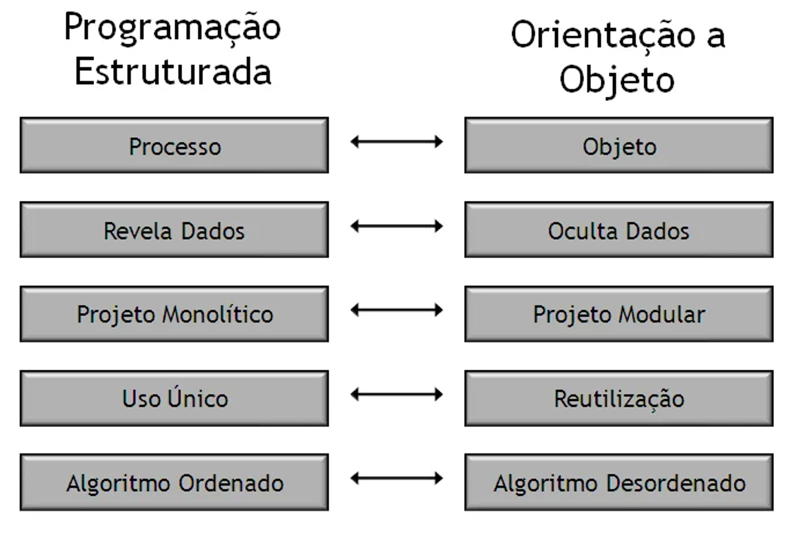
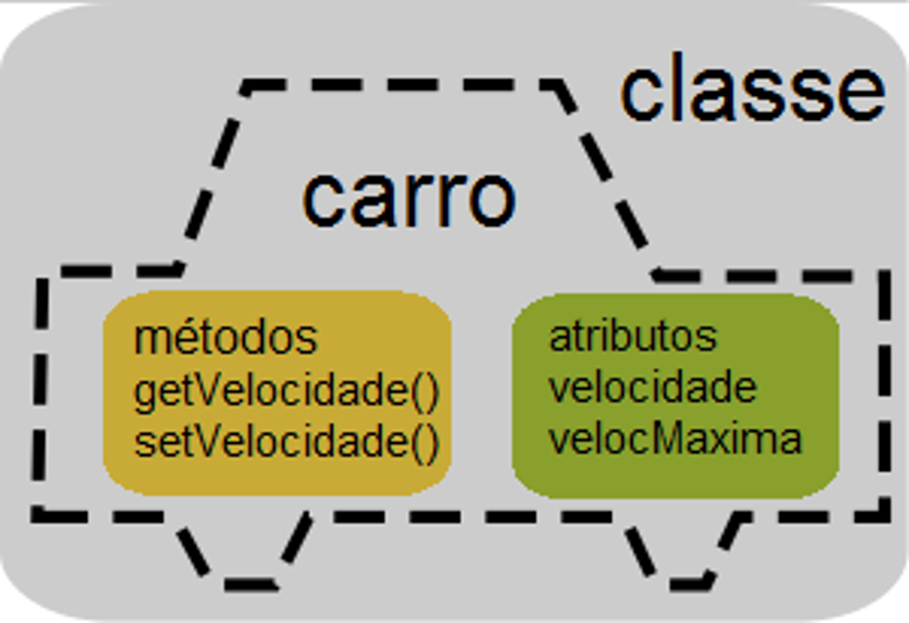
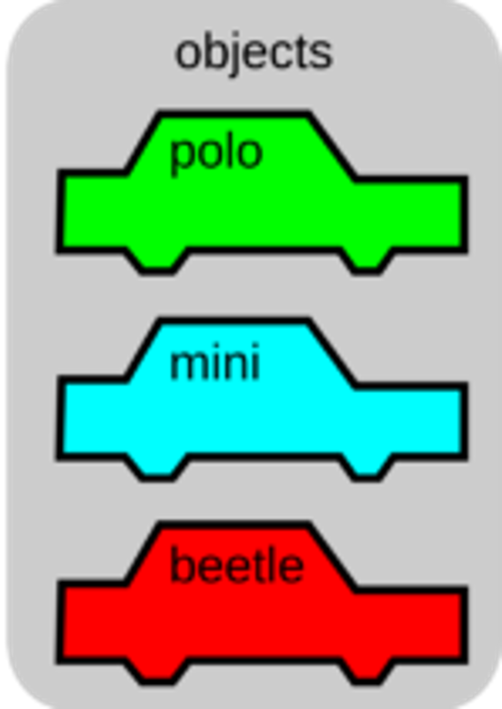
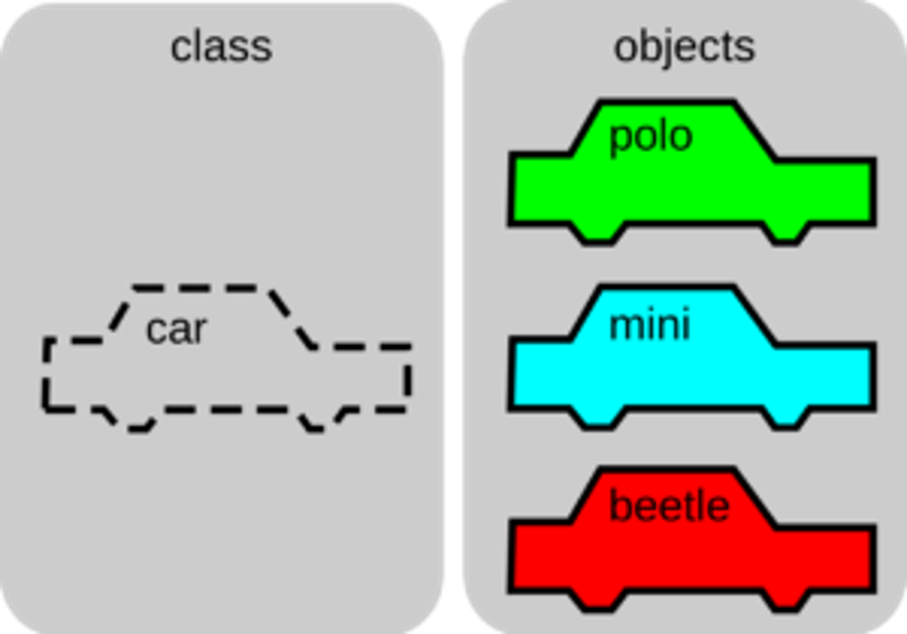
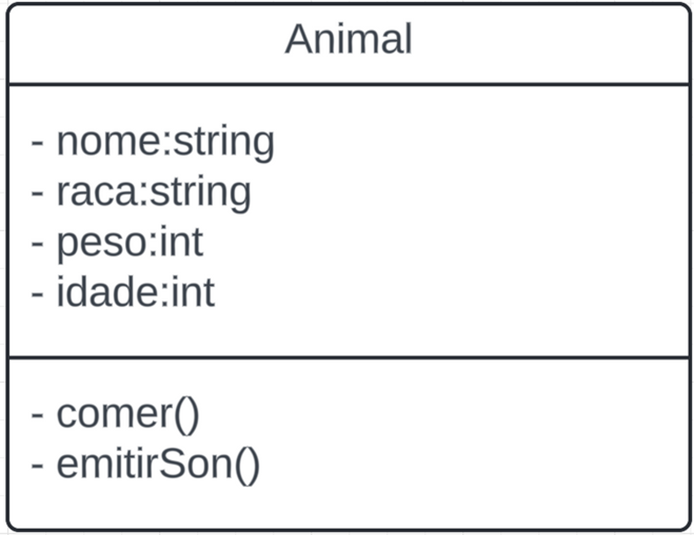

# 👨🏻‍💻 Técnico em Desenvolvimento de Sistemas - TURMA MANGAL DEV-D 2025

## 🍵 Programação Backend - Aula 02 - Introdução à Programação Orientada a Objetos
|Objetivo:|
|-|
|Compreender o paradigma da Programação Orientada a Objetos (POO) e seus principais conceitos: Classes, Objetos, Atributos e Métodos.|

---

## Paradigmas de Programação

### O que é um Paradigma?
Forma de classificar linguagens de programação de acordo com sua estrutura e abordagem para resolver problemas.

**Principais paradigmas:**
- **Programação Estruturada (PE):** baseada em sequência, decisão e iteração.  
- **Programação Orientada a Objetos (POO):** baseada no conceito de objetos que combinam dados (atributos) e comportamentos (métodos).

### Programação Estruturada
- **Definição:** Padrão com ênfase em sequência, decisão e repetição.  
- **Características:**  
  - Código organizado em blocos lógicos;  
  - Evita o uso de instruções GOTO;  
  - Fluxo de execução controlado por três estruturas fundamentais:
    - **Sequência** (execução linear de instruções);  
    - **Decisão** (if-else, switch-case);  
    - **Iteração** (for, while, do-while).  

### Programação Orientada a Objetos
- **Definição:** Paradigma que organiza o código em torno de **objetos**, que possuem atributos e métodos.  
- **Vantagens:**  
  - Reutilização de código;  
  - Modularidade;  
  - Facilidade de manutenção;  
  - Extensibilidade;  
  - Modelagem mais próxima do mundo real.  

---

## Conceitos Fundamentais da POO

### O que é Objeto?
Representação digital de algo do mundo real.  
Possui **atributos** (características) e **métodos** (ações).  

**Exemplo:**  
- Um carro tem:
	- Atributos: cor, modelo, ano. 
	- Métodos: acelerar, frear.

### O que é Classe?
Um **molde/projeto** que define os atributos e métodos de um conjunto de objetos.  
- **Exemplo:** Uma fábrica de carros (classe) produz vários carros (objetos) com as mesmas características gerais.

### O que são Atributos?
Características que descrevem o estado de um objeto.  
- Exemplo (Pessoa): nome, idade, altura, cor dos olhos.

### O que são Métodos?
Comportamentos ou ações que um objeto pode realizar.  
- Exemplo (Pessoa): andar, falar, comer.

---

## Resumindo os Conceitos
- **Classe:** modelo que define atributos e métodos.  
- **Objeto:** instância concreta de uma classe.  
- **Atributos:** características de um objeto.  
- **Métodos:** ações que o objeto pode realizar.  

---

## UML - Unified Modeling Language
- Linguagem de modelagem padrão para representar sistemas de software.  
- **Benefícios:**  
  - Comunicação clara entre desenvolvedores e analistas;  
  - Visualização e planejamento antes da codificação;  
  - Documentação do sistema;  
  - Identificação e correção de problemas de design.

  

---

## Conhecimentos Trabalhados
- 4. Programação orientada a objetos
	- 4.1. Definição
	- 4.2. Pacotes
	- 4.3. Classes
		- 4.3.1. Abstrata
		- 4.3.2. Interna
		- 4.3.3. Anônima
		- 4.3.4. Atributos
		- 4.3.5. Métodos
		- 4.3.6. Modificadores de acesso (encapsulamento)
	- 4.4. Objetos
- 5. Documentação
	- 5.1. Diagrama de classes

---

## Capacidade Técnica Desenvolvida
- 1. Utilizar o paradigma da programação orientada a objetos
- 2. Elaborar diagramas de classe  
- 3. Aplicar técnicas de código limpo (clean code) 

### Critérios Críticos trabalhados:
- Distinguiu corretamente as entidades, atributos e métodos do sistema, demonstrando a compreensão do domínio na utilização de cada um.
- Criou diagramas de classe UML, representando as entidades do sistema e seus relacionamentos (herança, agregação, composição)
- Aplicou práticas de clean code no código Java, demonstrando a capacidade de escrever código legível, organizado e de acordo com um guia de estilo.

### Critérios Desejáveis trabalhados:
- Implementou as classes das entidades em Java, incluindo atributos, construtores e métodos básicos, demonstrando a capacidade de traduzir o modelo conceitual em código.
- Justificou as escolhas de modelagem e os tipos de relacionamentos utilizados nos diagramas de classe, demonstrando a compreensão dos conceitos e sua aplicação no contexto do sistema. 
- Analisou um trecho de código Java com problemas de clean code e propõe soluções para refatorar o código, demonstrando a capacidade de identificar e corrigir problemas de legibilidade e organização. 

---

## Para Saber Mais
🎥 Video Aula  
📑 [Slides Aula 02](../aula02/02-Introducao-a-POO.pdf)
