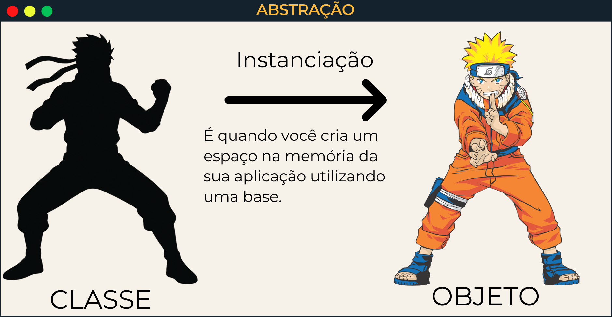
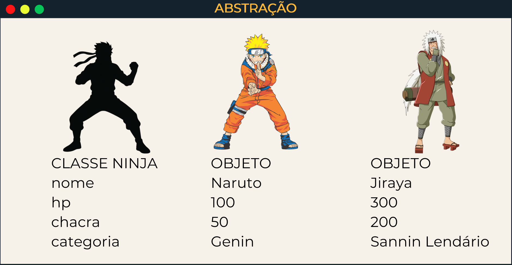

# 👨🏻‍💻 Técnico em Desenvolvimento de Sistemas - TURMA MANGAL DEV-D 2025

## 🍵 Programação Backend - Aula 03 - Pilares da POO: Abstração e Encapsulamento
|Objetivo:|
|-|
|Compreender os pilares da Programação Orientada a Objetos, focando nos conceitos de Abstração e Encapsulamento, aplicando-os em exemplos práticos com classes, objetos, construtores e métodos de acesso (getters e setters).|

---

## Abstração

### O que é Abstração?
**Definição:** Processo de **destacar apenas as características essenciais** de um objeto e representá-las no sistema.  
- Foco apenas no que é importante para o contexto.  
- Detalhes internos são ocultados.  

**Exemplo no mundo real:**  
- Quando pensamos em um **carro**, nos importamos com volante, motor e rodas, mas não com cada detalhe interno da injeção eletrônica.  

### Classe e Objeto
- **Classe:** modelo/base que define os atributos e comportamentos.  
- **Objeto:** instância concreta da classe.  

**Exemplo:**
- Existem diversos ninjas, porém todos eles tem carácteristicas (atributos) semelhantes:
    - nome;
    - aldeia;
    - chakra;
- E também todos tem ações (métodos) eles eles podem fazer:
    - usar um jutsu;


```java
class Ninja {
    String nome;
    String aldeia;
    int chakra;

    void usarJutsu(String jutsu) {
        System.out.println(nome + " usou " + jutsu + "!");
    }
}
````
- Após criar uma clase base para nosso objeto precisamos instanciar(criar) o objeto no nosso sistema:


```java
public class Main {
    public static void main(String[] args) {
        Ninja naruto = new Ninja(); // instanciando
        naruto.nome = "Naruto Uzumaki";
        naruto.aldeia = "Folha";
        naruto.chakra = 100;
        naruto.usarJutsu("Rasengan");
    }
}
````


### Construtor

**Definição:** Método especial chamado automaticamente ao criar um objeto.

**Função:** inicializar os atributos do objeto.

**Exemplo:**
```java
class Ninja {
    String nome;
    String aldeia;
    int chakra;

    public Ninja(String nome, String aldeia, int chakra) {
        this.nome = nome;
        this.aldeia = aldeia;
        this.chakra = chakra;
    }
}
````

### A Classe `Main`
**Definição:**  
A classe `Main` é o ponto de entrada de um programa em Java.  
É nela que colocamos o **método principal**:  

```java
public static void main(String[] args) {
    // código que será executado ao iniciar o programa
}
````

**Explicando cada parte:**
- public → significa que o método pode ser acessado de qualquer lugar.
- static → permite chamar o método sem precisar criar um objeto da classe.
- void → indica que o método não retorna nenhum valor.
- main → nome fixo reconhecido pela JVM (Java Virtual Machine) como ponto inicial.
- String[] args → parâmetro que pode receber argumentos vindos da linha de comando.

Exemplo:
```java
public class Main {
    public static void main(String[] args) {
        System.out.println("Olá, mundo!");
    }
}
````

## Encapsulamento
### O que é Encapsulamento?

**Definição:** Pilar que protege os dados internos de um objeto, permitindo que sejam acessados de forma controlada.
- Os atributos ficam privados.
- O acesso e a modificação acontecem via getters e setters.

> 👉 Regra de ouro: Não expor diretamente os atributos → usar métodos de acesso.

### Getters e Setters

- Getter (get): pega / retorna o valor de um atributo privado.
- Setter (set): define / altera o valor de um atributo privado.

**Exemplo:**
```java
class Ninja {
    private String nome;
    private String aldeia;
    private int chakra;

    public Ninja(String nome, String aldeia, int chakra) {
        this.nome = nome;
        this.aldeia = aldeia;
        this.chakra = chakra;
    }

    public String getNome() {
         return nome; 
    }

    public void setNome(String nome) {
         this.nome = nome; 
    }

    public String getAldeia() {
         return aldeia; 
    }

    public void setAldeia(String aldeia) {
         this.aldeia = aldeia; 
    }

    public int getChakra() {
         return chakra; 
    }

    public void setChakra(int chakra) {
         this.chakra = chakra; 
    }

    public void usarJutsu(String jutsu) {
        if (chakra > 0) {
            System.out.println(nome + " usou " + jutsu + "!");
            chakra -= 10;
        } else {
            System.out.println(nome + " está sem chakra!");
        }
    }
}
````

- Agora a instanciação do objeto:
```java
public class Main {
    public static void main(String[] args) {
        Ninja naruto = new Ninja("Naruto Uzumaki", "Folha", 100);

        System.out.println("Ninja: " + naruto.getNome());

        System.out.println("Aldeia: " + naruto.getAldeia());

        System.out.println("Chakra inicial: " + naruto.getChakra());

        naruto.usarJutsu("Rasengan");
        System.out.println("Chakra restante: " + naruto.getChakra());
    }
}
````
### O que é o `this`?
**Definição:** Palavra-chave em Java que faz referência ao **próprio objeto atual** da classe.  
Ela é usada principalmente para:  
- **Diferenciar atributos e parâmetros** quando possuem o mesmo nome;  
- **Passar o objeto atual** como argumento para outro método ou construtor;  
- **Chamar outros construtores da mesma classe**.  
**Exemplo simples:**
```java
class Ninja {
    private String nome;
    private int chakra;

    // Construtor
    public Ninja(String nome, int chakra) {
        this.nome = nome;     // "this.nome" se refere ao atributo da classe
        this.chakra = chakra; // enquanto "chakra" é o parâmetro recebido
    }

    public void mostrarStatus() {
        System.out.println("Ninja: " + this.nome + " | Chakra: " + this.chakra);
    }
}
````