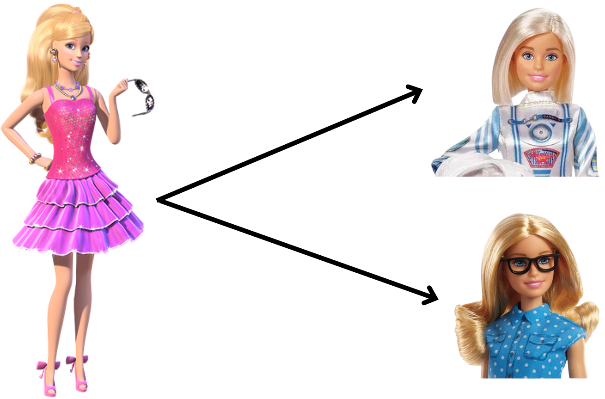
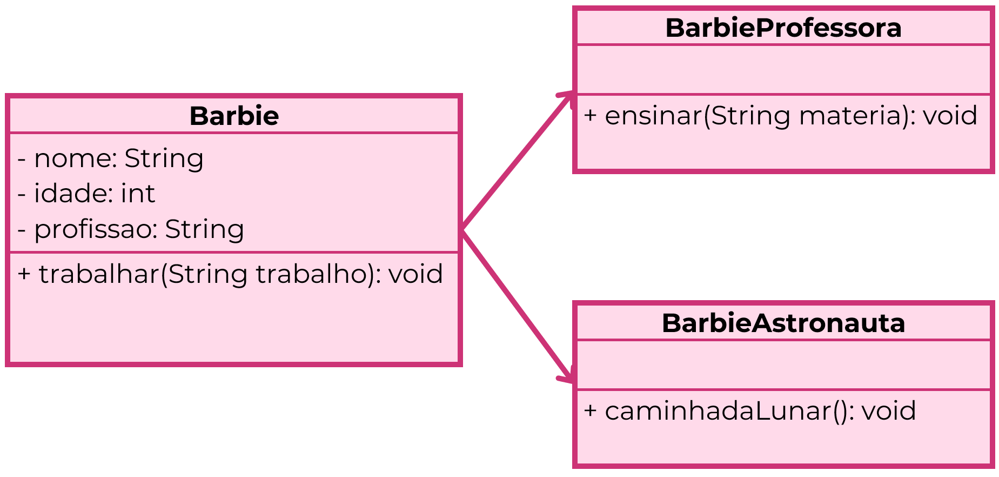
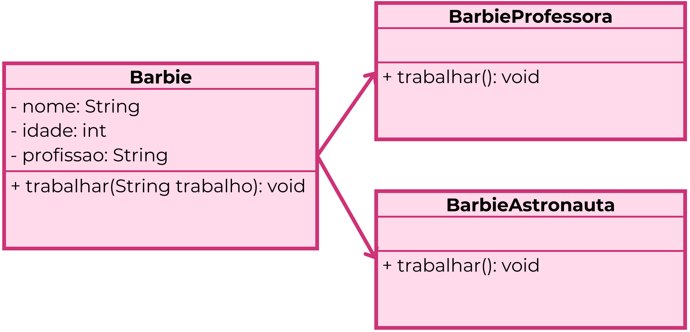

# 👨🏻‍💻 Técnico em Desenvolvimento de Sistemas - TURMA MANGAL DEV-D 2025

## 🍵 Programação Backend - Aula 04 - Pilares da POO: Herança e Polimorfismo
|Objetivo:|
|-|
|Compreender os pilares da Programação Orientada a Objetos relacionados à reutilização de código e flexibilidade de comportamento: **Herança** e **Polimorfismo**.|

---

## Revisando os Pilares da POO
- **Abstração:** focar apenas nas características essenciais de um objeto.  
- **Encapsulamento:** proteger os dados internos, controlando o acesso com métodos.  
- **Herança:** reutilizar atributos e métodos de uma classe base (pai).  
- **Polimorfismo:** permitir que o mesmo método tenha comportamentos diferentes.  

---

## Herança

### O que é Herança?
**Definição:** Pilar que permite que uma **classe filha** herde atributos e métodos de uma **classe pai**.  
- Evita repetição de código;  
- Cria uma hierarquia lógica;  
- Permite reuso e organização do sistema. 



**Exemplo:**
```java
class Barbie {
    String nome;
    String profissao;
    int idade;

    void trabalhar() {
        System.out.println(nome + " está trabalhando como " + profissao + "!");
    }
}
````

```java
public class Main {
    public static void main(String[] args) {
        Barbie barbie = new Barbie();
        barbie.nome = "Prof Barbie";
        barbie.profissao = "Professora";
        barbie.idade = 25;
        barbie.trabalhar();
    }
}
````
### Classe Filha (extends)

```java
class BarbieProfessora extends Barbie {
    void ensinar(String materia) {
        System.out.println(nome + " está ensinando " + materia + "!");
    }
}
````

```java
public class Main {
    public static void main(String[] args) {
        BarbieProfessora barbie1 = new BarbieProfessora();
        barbie1.nome = "Prof Barbie";
        barbie1.idade = 25;
        barbie1.ensinar("Matemática");
    }
}
````

## Polimorfismo

### O que é Polimorfismo?

**Definição:** Significa “muitas formas”.
Permite que um mesmo método seja chamado em diferentes classes, mas com comportamentos distintos.
> 👉 Isso é feito por sobrescrita de métodos (override).


Exemplo com sobrescrita:
````java
class BarbieAstronauta extends Barbie {
    @Override
    void trabalhar() {
        System.out.println(nome + " está explorando o espaço!");
    }
}
````

### Demonstração
````java
public class Main {
    public static void main(String[] args) {
        Barbie barbie = new Barbie();
        barbie.nome = "Prof Barbie";
        barbie.profissao = "Professora";

        BarbieAstronauta barbie2 = new BarbieAstronauta();
        barbie2.nome = "Capitã Barbie";

        barbie.trabalhar();   // Usa o método da classe Barbie
        barbie2.trabalhar();  // Usa o método sobrescrito da classe BarbieAstronauta
    }
}
````
> 👉 A mesma chamada .trabalhar() gera resultados diferentes, dependendo do objeto.


---

## Conhecimentos Trabalhados
- 4. Programação orientada a objetos
	- 4.1. Definição
	- 4.2. Pacotes
	- 4.3. Classes
		- 4.3.1. Abstrata
		- 4.3.4. Atributos
		- 4.3.5. Métodos
		- 4.3.6. Modificadores de acesso (encapsulamento)
	- 4.4. Objetos
	- 4.6. Polimorfismo
	- 4.8. Relacionamentos de objetos
		- 4.8.1. Herança

- 5. Documentação
	- 5.1. Diagrama de classes

---

## Capacidade Técnica Desenvolvida
- 1. Utilizar o paradigma da programação orientada a objetos
- 2. Elaborar diagramas de classe  
- 3. Aplicar técnicas de código limpo (clean code) 

### Critérios Críticos trabalhados:
- Distinguiu corretamente as entidades, atributos e métodos do sistema, demonstrando a compreensão do domínio na utilização de cada um.
- Criou diagramas de classe UML, representando as entidades do sistema e seus relacionamentos (herança, agregação, composição)
- Aplicou práticas de clean code no código Java, demonstrando a capacidade de escrever código legível, organizado e de acordo com um guia de estilo.

### Critérios Desejáveis trabalhados:
- Implementou as classes das entidades em Java, incluindo atributos, construtores e métodos básicos, demonstrando a capacidade de traduzir o modelo conceitual em código.
- Justificou as escolhas de modelagem e os tipos de relacionamentos utilizados nos diagramas de classe, demonstrando a compreensão dos conceitos e sua aplicação no contexto do sistema. 
- Analisou um trecho de código Java com problemas de clean code e propõe soluções para refatorar o código, demonstrando a capacidade de identificar e corrigir problemas de legibilidade e organização. 

---

## Para Saber Mais
📑 [Slides Aula 04](../aula04/aula04.pdf)
