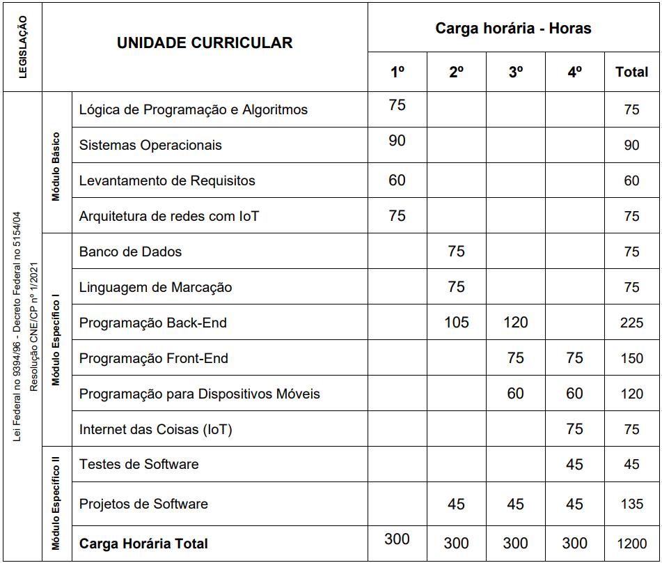
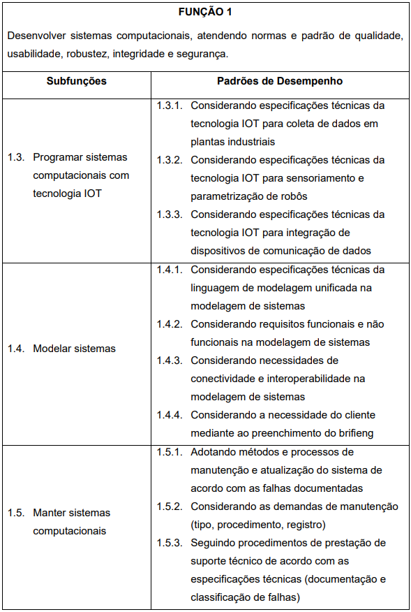
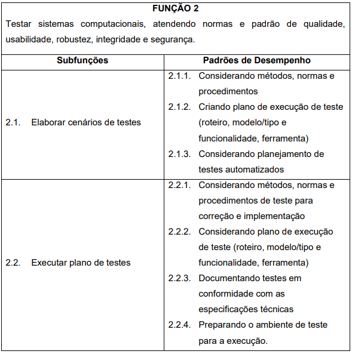
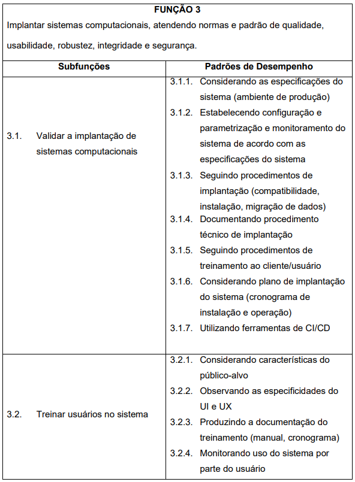

# 👨🏻‍💻 Técnico em Desenvolvimento de Sistemas

## 🎓 Formação Técnica e Profissional
Esse itinerário específico é voltado para a Formação Técnica e Profissional dos estudantes em parceria SEDUC (Secretaria de Educação do Estado de São Paulo) e SESI (Serviço Social da Indústria) e SENAI (Serviço Nacional de Aprendizagem Industrial).

## [Plano de Curso](./assets/planodecurso.pdf)
## Semestres
- 1º Semestre
    - Lógica de Programação e Algoritmos (75 horas/100 aulas)
    - Sistemas Operacionais (90 horas/120 aulas)
    - Levantamento de Requisitos (60 horas/80 aulas)
    - Arquitetura de Redes com IoT (75 horas/100 aulas)
- 2º Semestre
    - Bancos de Dados (75 horas/100 aulas)
    - Linguagem de Marcação (75 horas/100 aulas)
    - Programção Back-End 1(105 horas/140 aulas)
    - Projetos de Software (45 horas/60 aulas)
- 3º Semestre
    - Programação Front-End 1 (75 horas/100 aulas)
    - Programção Back-End 2(120 horas/160 aulas)
    - Programação Para Dispositivos Móveis (60 horas/80 aulas)
    - Projetos de Software 02 (45 horas/60 aulas)
- 4º Semestre
    - Internet das Coisas (75 horas/100 aulas)
    - Programação Front-End 2 (75 horas/100 aulas)
    - Programação Para Dispositivos Móveis (60 horas/80 aulas)
    - Testes de Software (45 horas/60 aulas)
    - Projetos de Software 03 (45 horas/60 aulas)

## Destaque do Plano de Curso
- 
- 
- 
- 
- 
